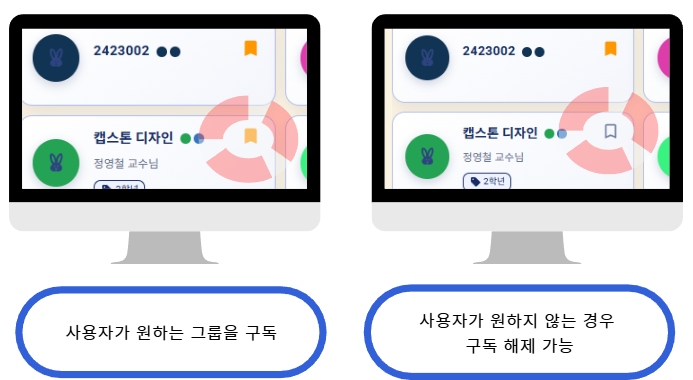
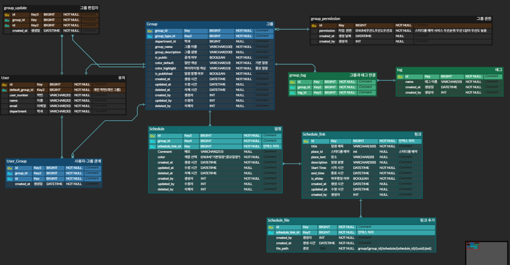

# Schedule Service

그룹 기반 일정 관리와 선택적 일정 동기화를 제공하는 스케줄 관리 서비스

---

## 프로젝트 배경

우리 학과는 신설된 학과로,  1학년과 2학년이 함께 사용하는 실습실이 하나뿐인 환경입니다.

이로 인해 한 학년이 실습을 진행하면 다른 학년은 실습실을 사용할 수 없는 불편한 상황이 반복되었습니다.

또한 학과 특성상  수업, 특강, 취업 면담 등 **일정 변경이 잦아**,  기존 방식으로는 일정을 효율적으로 공유하고 관리하는 데 한계가 있었습니다.

이러한 문제를 해결하기 위해  **자습실 예약과 학과 일정을 함께 관리할 수 있는 시스템**을 기획하게 되었으며,  
그중 저는 **스케줄 관리 백엔드 파트**를 담당했습니다.

---

## 서비스 개요

Schedule Service는  수업, 특강, 취업 면담처럼 여러 사람이 함께 사용하는 일정을  
**그룹 단위**로 관리하고,  사용자가 원하는 경우 해당 그룹의 일정을  
**개인 일정에 자동으로 반영**해주는 서비스입니다.

일정 변경이 잦은 환경에서도  최신 일정이 누락 없이 전달되도록 설계되었습니다.

---

## 서비스 목표

- 그룹 단위로 일정을 한 번만 관리
- 사용자는 필요한 일정만 선택적으로 수신
- 일정 변경 시 개인 일정 자동 반영
- 데이터 중복 없이 일관성 유지

---

## 그룹 기반 일정 관리

일정은 **그룹 단위**로 관리됩니다.

각 그룹은 여러 개의 일정을 가질 수 있으며,  그룹 일정의 생성·수정·삭제는  해당 그룹을 구독한 사용자에게 자동으로 반영됩니다.

---

## 구독(Subscription)이란?

구독이란  
“이 그룹의 일정을 내 개인 일정에 자동으로 반영하겠다”는 사용자의 선택입니다.

  

- 구독하지 않은 경우  
  그룹 일정은 존재하지만 개인 일정에는 표시되지 않습니다.

- 구독한 경우  
  그룹 일정이 개인 일정으로 자동 생성되며,  
  일정의 수정·삭제 또한 함께 동기화됩니다.

즉, **구독은 일정 동기화 여부를 결정하는 관계**입니다.

---

## 일정 데이터 설계

  

### Schedule / ScheduleLink 분리

- Schedule  
  그룹에 속한 원본 일정

- ScheduleLink  
  사용자와 일정 간의 구독 관계

이 구조를 통해  일정 데이터의 중복 저장을 방지하고, 하나의 일정 변경으로 
여러 사용자의 일정을안정적으로 관리할 수 있도록 설계했습니다.

---

## 태그(Tag) 기반 일정 분류

일정은 태그 단위로 분류됩니다.

태그를 통해  
일정의 성격을 직관적으로 구분할 수 있으며, 일정이 많아져도 가독성을 유지할 수 있도록 했습니다.

태그는 일정과 다대다 관계로 설계되어 확장성과 유연성을 확보했습니다.

---

## 기대 효과

- 일정 변경 누락 방지
- 관리자는 일정 한 번만 수정
- 사용자는 최신 일정 자동 반영
- 일정 분류 기준 명확화
- 서비스 확장에 유리한 구조

---

## 신경 쓴 부분

- 일정 관리를 단순 CRUD가 아닌 **그룹, 일정, 스케줄 링크, 태그**라는 도메인 개념으로 분리해 설계
- 구독한 경우에만 개인 일정에 반영되도록 연동 구조 구현
- 데이터베이스 설계를 가장 우선적으로 고려
- MSA 환경에서 다른 서비스와 연동하기 쉬운 구조를 지향

---

## 어려웠던 점

- gRPC와 Kafka 기반의 비동기 통신 구조를 처음 접하며  
  데이터 흐름을 이해하는 데 어려움이 있었음
- 요청이 없어도 변경된 데이터가 자동으로 전달되는  
  구독 기반 통신 방식을 이해하며 구조에 대한 이해가 깊어짐

---

## 배운 점

- 도메인을 먼저 정의하지 않으면 구조와 책임이 쉽게 흐려진다는 점을 경험
- 설계가 개발의 방향과 품질을 결정한다는 것을 체감
- 변수명, 테이블명 등 네이밍의 명확성이 유지보수성과 협업에 직결됨을 인식
- 백엔드 개발에서 설계와 도메인 정의의 중요성을 깊이 이해하게 됨

---

## 향후 개선 포인트

- Kafka 연동을 통해 일정 변경 이벤트를 다른 서비스로 비동기 전달
- 스터디룸 서비스의 예약 기능을 스케줄 서비스 내에서 직접 처리할 수 있도록 기능 확장

---

## 참고

- 본 서비스는 MSA 구조의 일부로 설계되었으며, 서비스 간 연동과 확장을 고려한 구조로 개발되었습니다.
